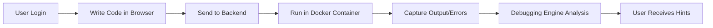

# TraceCode

**Secure Multi-Language Code Execution, Debugging, and Explanation Platform**

---

## 🔍 About the Project

TraceCode is a secure, web-based programming assistance platform that allows users to write, run, debug, and understand code in multiple programming languages.

It is designed primarily for **students and individual learners**, similar to platforms like Google Classroom but focused on hands-on coding practice.

> Unlike traditional online compilers that only show output or errors, **TraceCode explains why an error occurred and how to fix it**, without revealing the full solution.

---

## 🧠 What Problem Does TraceCode Solve?

### Existing Problems

| Problem | Impact |
|---------|--------|
| Beginners struggle to understand compiler and runtime errors | Frustration and slow learning |
| Students depend on copying solutions instead of learning | No real skill development |
| Online compilers lack explanations | Users don't understand mistakes |
| No secure way to run untrusted code | Security risks in educational settings |
| No personal learning history or progress tracking | Cannot measure improvement |

### Solution Provided by TraceCode

- ✅ Runs code safely using **Docker sandboxing**
- ✅ Detects **syntax, runtime, and logical errors**
- ✅ Provides **step-by-step debugging hints**
- ✅ Explains errors in **simple language**
- ✅ Stores **personal learning history**

---

## 🛠️ How TraceCode Works (High Level)



1. User logs in securely using **Firebase Authentication**
2. User writes code in the browser
3. Code is sent to backend
4. Backend runs code in an **isolated Docker container**
5. Output and errors are captured
6. Debugging engine analyzes the issue
7. User receives **explanation and hints**

---

## 🧪 Supported Languages

| Language | Extension | Status |
|----------|-----------|--------|
| Python   | `.py`     | ✅ Supported |
| C        | `.c`      | ✅ Supported |
| C++      | `.cpp`    | ✅ Supported |
| Java     | `.java`   | ✅ Supported |

---

## 🎯 Use Cases

### 🧑‍🎓 Use Case 1: College Student Learning Programming

- Student writes lab programs
- Gets immediate feedback
- Learns how to debug errors
- Improves coding skills independently

### 👨‍💻 Use Case 2: Self-Learning & Practice

- Individuals practicing DSA or programming basics
- Understand mistakes instead of just fixing them
- Track improvement over time

### 🏫 Use Case 3: Google Classroom-Style Coding Support

- Used alongside classroom teaching
- Students submit code and learn from errors
- Backend can later be extended for teacher analytics

### 🧪 Use Case 4: Secure Online Compiler Replacement

- Safer than public online compilers
- Prevents misuse of system resources
- Ideal for educational institutions

---

## ⭐ Advantages of TraceCode

### 🔐 1. Secure Code Execution

- Uses **Docker sandbox**
- No internet access for executed code
- CPU and memory limits
- Prevents malicious code execution

### 🧠 2. Intelligent Debugging Assistance

- Explains **why** an error occurred
- Categorizes error types (syntax, runtime, logical)
- Provides learning-oriented hints

### 📚 3. Promotes Conceptual Learning

- No full solution disclosure
- Encourages problem solving
- Helps students think critically

### 🌍 4. Multi-Language Support

- Learn and practice multiple languages in one platform

### 🧑‍💻 5. Personal Learning History

- Stores past submissions
- Tracks progress
- Identifies repeated mistakes

### ⚡ 6. Scalable & Extendable

Can be expanded to:
- Classroom analytics
- Instructor dashboards
- Auto grading
- Plagiarism detection

### 🎓 7. Ideal for Academic Projects

- Real-world relevance
- Uses modern technologies
- Demonstrates system design & security
- Strong mini-project value

---

## 🏗️ Tech Stack

### Frontend
- **React** + **TypeScript**
- **Vite** (Build tool)
- **Tailwind CSS** (Styling)
- **shadcn/ui** (Component library)
- **Monaco Editor** (Code editor)

### Backend
- **Python FastAPI**
- **Docker** (Code execution sandbox)
- **Google Gemini AI** (Hint generation)

### Authentication
- **Firebase Authentication**
- **JWT Tokens**

---

## 📁 Project Structure

```
tracecode/
├── src/                    # React frontend
│   ├── components/         # UI components
│   │   ├── ui/             # shadcn/ui components
│   │   ├── code-editor/    # Monaco editor integration
│   │   └── layout/         # Navigation components
│   ├── pages/              # Route pages
│   │   ├── student/        # Student dashboard, editor
│   │   ├── instructor/     # Instructor analytics
│   │   └── admin/          # Admin panel
│   └── contexts/           # React contexts
│
├── server/                 # Python backend
│   ├── main.py             # FastAPI app entry point
│   ├── routes/             # API endpoints
│   │   ├── auth.py         # Authentication
│   │   ├── code.py         # Code execution
│   │   ├── hints.py        # AI hint generation
│   │   └── analytics.py    # Usage analytics
│   └── services/           # Business logic
│       ├── code_service.py # Sandboxed code runner
│       ├── hint_service.py # Gemini AI integration
│       └── auth_service.py # User management
│
└── public/                 # Static assets
```

---

## 🚀 Getting Started

### Prerequisites
- Node.js & npm
- Python 3.8+
- Docker (for production sandbox)

### Frontend Setup
```bash
npm install
npm run dev
```

### Backend Setup
```bash
cd server
pip install -r requirements.txt
uvicorn main:app --reload
```

### Environment Variables
Copy `server/.env.example` to `server/.env` and configure:
```
GEMINI_API_KEY=your_gemini_api_key
JWT_SECRET_KEY=your_secret_key
FIREBASE_PROJECT_ID=your_firebase_project
```

---

## 📄 License

MIT License

---

*Built for better learning. Debug smarter, learn faster.*
